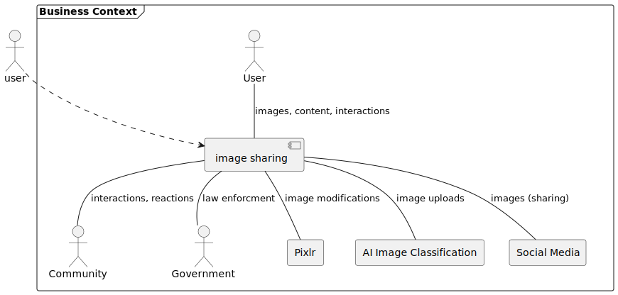

# 

**About arc42**

arc42, the template for documentation of software and system
architecture.

Template Version 8.2 EN. (based upon AsciiDoc version), January 2023

Created, maintained and © by Dr. Peter Hruschka, Dr. Gernot Starke and
contributors. See <https://arc42.org>.

This version of the template contains some help and explanations. It is
used for familiarization with arc42 and the understanding of the
concepts. For documentation of your own system you use better the
*plain* version.

# Introduction and Goals

The image sharing app allows users to upload, edit and share images with their friends, family and the wider community. 

## Requirements Overview

**Contents**

Main features of the app are:

* Upload photos
* Share photos with friends, family and the wider community
* Image editing with third party integration (Pixlr)
* Community feed, challenges and comment options for interacting with other users

## Quality Goals

| Priority | Quality     | Motivation                                                                                              |
| -------- | ----------- | ------------------------------------------------------------------------------------------------------- |
| 1        | Security    | Protect the private data and rights of our users to gather their trust.                                 |
| 2        | Reliability | Allows for rapid growth of our app. The platform must be able to handle hundreds of thousands of users. |
| 3        | Usability   | Make sure the user loves using our app.                                                                 |

## Stakeholders

| Role/Name               | Expectations                                                   |
| ----------------------- | -------------------------------------------------------------- |
| Investor 1              | Return of Investment (ROI) for his share on the company        |
| Investor 2              | Long term investment and growth                                |
| Team Leader             | Hassle-free executino of the project                           |
| Lead Marketing Engineer | Popularize and grow the app                                    |
| Lead System Architect   | Build and maintain a scalable and secure hardware architecture |
| Lead Software Architect | Implement the software itself                                  |

# Architecture Constraints

| Constraints                       | Backgrounds and/or motivation                                                                         |
| --------------------------------- | ----------------------------------------------------------------------------------------------------- |
| Ease of use                       | We want our app to be as accessible as possible                                                       |
| Advanced editing posibilities     | We want our users to stay within the app                                                              |
| Crossplatform Development         | We dont have the resources to maintain two codebases                                                  |
| Backend Implementation in Node.Js | While the Backend is implemented in JavaScript, the API will be designed based on the REST principles |
| OS Independent development        | The development should work regardless of the desktop OS, as our team uses multiple different devices |

# System Scope and Context

**Contents**

System scope and context - as the name suggests - delimits your system
(i.e. your scope) from all its communication partners (neighboring
systems and users, i.e. the context of your system). It thereby
specifies the external interfaces.

If necessary, differentiate the business context (domain specific inputs
and outputs) from the technical context (channels, protocols, hardware).

**Motivation**

The domain interfaces and technical interfaces to communication partners
are among your system’s most critical aspects. Make sure that you
completely understand them.

**Form**

Various options:

-   Context diagrams

-   Lists of communication partners and their interfaces.

See [Context and Scope](https://docs.arc42.org/section-3/) in the arc42
documentation.

## Business Context

Our system interacts with Pixlr to support advanced image editing use cases and also allows for sharing content on other social media platforms. To ensure compliance with legislation and also our own rules for allowed content, we use an external AI service to analize image uploads and classify them. Actors that interact with our system are the user and other users (community) as well as the government.

## Technical Context

**Contents**

The technical interfaces of our system comprise various channels and transmission media that connect our system with its environment. These interfaces facilitate the exchange of data and communication with external entities. They include:

**Motivation**

Understanding the technical interfaces between our system and its context is crucial for making architectural decisions. These interfaces significantly influence infrastructure and hardware design choices.

**Form**

The technical interfaces can be represented in various ways:

- **UML Deployment Diagram**: Describing channels to neighboring systems.
- **Mapping Table**: Showing relationships between channels and input/output.

**Explanation of Technical Interfaces**

- **HTTP/HTTPS Protocol**: This protocol serves as the primary means of interaction with external services, enabling functionalities like image editing through Pixlr integration and sharing content on other social media platforms. It processes incoming requests from users for various app features and sends corresponding responses.

- **Internal Messaging System**: This system allows different components or microservices within our app's architecture to communicate seamlessly. For instance, it facilitates interactions between the image processing service, user authentication service, and content sharing service.

- **Database Connectivity**: The database serves as a central repository for storing user-generated content, including uploaded images, user profiles, and application settings. It is accessed by various components to fetch required data and store new information.

**Mapping Input/Output to Channels**

| Input/Output               | Channel                       |
|----------------------------|-------------------------------|
| User image upload          | HTTP/HTTPS Protocol           |
| Image editing requests     | HTTP/HTTPS Protocol           |
| Content sharing            | HTTP/HTTPS Protocol           |
| Internal service requests  | Internal Messaging System    |
| Database queries/retrieval | Database Connectivity         |

This mapping table outlines the correspondence between specific input/output actions and the channels through which they operate within the system's technical interfaces.

# Solution Strategy

The app will be developed as a multiplatform app with a shared code base using the Flutter framework. While the flutter app represents the client side of the app, the backend and server will be implemented as a Node.JS application.

| Goal/Requirement        | Architectural Approach     | Details                                                  |
|-------------------------|----------------------------|----------------------------------------------------------|
| Consistent Communication| RESTful Architecture       | [Rest Api Details](#rest-api) |
| Image Handling Standard  | Standardization            | [Link Not Working](#image-format) |
| Data Security and Privacy| End-to-End Encryption (e2e) |[Security and Privacy Details](#security-and-privacy)|
| Unified Logging          | Centralized Logging        | [Common logging format Details](#common-logging-format)|

# Building Block View

## Whitebox Overall System

Motivation

The motivation behind this decomposition is to achieve a modular and scalable design that enhances maintainability, flexibility, and collaboration among development teams. Each building block plays a importantrole in fulfilling specific functionalities and, when combined, forms a cohesive and robust system.

By breaking down the system into distinct components such as UI Client, Search, Posts, User Management, Third-party Integration, File Storage, and Authentication, we aim to encapsulate specific responsibilities within well-defined boundaries. This approach improves the code reusability, allows independent development and testing of each module.

As we explore the descriptions and connections of each black box, we will explain how our system works on the inside.

  | Building Block              | Description                                               |
|-----------------------------|-----------------------------------------------------------|
| UI Client                   | The user interface component responsible for rendering and interacting with the application on the client side.|
| Search                      | Functionality for searching and retrieving relevant information from the system, enhancing user experience.|
| Posts                       | Manages the creation, retrieval, and manipulation of user-generated content, such as articles, posts, or messages.|
| User Management             | Handles user-related functionalities, including registration, login, profile management, and permissions.|
| Third-party Integration     | Enables the integration of external services or APIs to enhance the application's functionality through third-party services.|
| File Storage                | Manages the storage and retrieval of files, images, or other media within the system.|
| Authentication              | Ensures secure access to the system by verifying and validating the identity of users during login and session management.|

### UI Client

**Purpose/Responsibility:**  
The UI Client serves as the front-end interface responsible for rendering and facilitating user interaction with the application. It provides a visually appealing and user-friendly experience, ensuring seamless navigation and accessibility.

**Interface(s):**

-   User input handling
-   Communication with the server-side components through defined API endpoints

**Quality/Performance Characteristics:**

-   Responsiveness
-   Cross-browser compatibility
-   User interface responsiveness

**Directory/File Location:**

-   `/client/ui`

**Fulfilled Requirements:**

-   Requirement #1: Intuitive user interface design
-   Requirement #2: Cross-browser compatibility

**Open Issues/Problems/Risks:**

-   Potential latency issues in resource-intensive operations

### Search

**Purpose/Responsibility:**  
The Search component is responsible for enabling users to search and retrieve relevant information within the system efficiently. It enhances user experience by providing quick and accurate search results.

**Interface(s):**

-   Query processing and indexing
-   Integration with external search engines or algorithms

**Quality/Performance Characteristics:**

-   Search accuracy
-   Query response time

**Directory/File Location:**

-   `/services/search`

**Fulfilled Requirements:**

-   Requirement #5: Efficient and accurate search functionality

**Open Issues/Problems/Risks:**

-   Integration challenges with certain search algorithms

### Posts

**Purpose/Responsibility:**  
The Posts component manages the creation, retrieval, and manipulation of user-generated content such as articles, posts, or messages within the system.

**Interface(s):**

-   CRUD (Create, Read, Update, Delete) operations for posts
-   Integration with the authentication system for user-specific posts

**Quality/Performance Characteristics:**

-   Speed and efficiency in handling large datasets

**Directory/File Location:**

-   `/services/posts`

**Fulfilled Requirements:**

-   Requirement #3: Efficient handling of user-generated content

**Open Issues/Problems/Risks:**

-   Potential scalability concerns with a high volume of posts

### User Management

**Purpose/Responsibility:**  
User Management oversees user-related functionalities, including registration, login, profile management, and permissions.

**Interface(s):**

-   User authentication and authorization
-   User profile data retrieval and update operations

**Quality/Performance Characteristics:**

-   Secure user authentication
-   Authorization control based on user roles

**Directory/File Location:**

-   `/services/user_management`

**Fulfilled Requirements:**

-   Requirement #4: Secure user authentication and authorization

**Open Issues/Problems/Risks:**

-   Potential vulnerabilities in the authentication process

### Third-party Integration

**Purpose/Responsibility:**  
Third-party Integration facilitates the seamless integration of external services or APIs to enhance the application's functionality.

**Interface(s):**

-   Communication with third-party APIs
-   Data exchange formats and protocols

**Quality/Performance Characteristics:**

-   Reliability of third-party service connections

**Directory/File Location:**

-   `/integrations/third_party`

**Fulfilled Requirements:**

-   Requirement #6: Integration with specified third-party services

**Open Issues/Problems/Risks:**

-   Dependency on third-party service availability

### File Storage

**Purpose/Responsibility:**  
File Storage manages the storage and retrieval of files, images, or other media within the system.

**Interface(s):**

-   File upload and download operations
-   Integration with the authentication system for secure access control

**Quality/Performance Characteristics:**

-   Scalability and efficiency in handling large files

**Directory/File Location:**

-   `/services/file_storage`

**Fulfilled Requirements:**

-   Requirement #7: Efficient file storage and retrieval

**Open Issues/Problems/Risks:**

-   Potential constraints on storage capacity

### Authentication

**Purpose/Responsibility:**  
Authentication ensures secure access to the system by verifying and validating the identity of users during login and session management.

**Interface(s):**

-   User login and logout operations
-   Integration with user management for authentication data

**Quality/Performance Characteristics:**

-   Security of user credentials
-   Session management efficiency

**Directory/File Location:**

-   `/services/authentication`

**Fulfilled Requirements:**

-   Requirement #8: Secure user authentication

**Open Issues/Problems/Risks:**

-   Potential vulnerabilities in session management

  

## Level 2
 

**Motivation**

The motivation behind this decomposition is to achieve a modular and maintainable design that allows for the efficient handling of user-generated content. By breaking down the "Posts" building block into distinct components—PostController, PostService, and PostRepository—we aim to encapsulate specific responsibilities within well-defined boundaries.

The PostController serves as the entry point for post-related operations, handling user requests and orchestrating the flow of data between the user interface and the underlying services. The PostService encapsulates the business logic and rules associated with posts, ensuring consistency and coherence in post-related functionalities. Lastly, the PostRepository manages the data access layer, handling database interactions and ensuring the persistence and integrity of post-related data.

  | Building Block       | Description                                                          |
|----------------------|----------------------------------------------------------------------|
| PostController       | Responsible for handling incoming requests related to posts. It processes user input, communicates with the PostService, and manages the overall flow of post-related operations. |
| PostService           | Manages the business logic and application-specific rules related to posts. It coordinates with the PostRepository for data retrieval and storage, ensuring proper handling of post-related operations. |
| PostRepository       | Deals with the data access layer for posts. It is responsible for database interactions, including storing, retrieving, updating, and deleting post-related data. The PostRepository communicates with the database to ensure data integrity and persistence. |

### PostController

**Purpose/Responsibility:**  
The PostController is responsible for handling incoming requests related to posts. It processes user input, communicates with the PostService, and manages the overall flow of post-related operations.

**Interface(s):**

-   User input handling
-   Communication with the PostService

**Quality/Performance Characteristics:**

-   Responsiveness in processing user requests
-   Efficiency in managing the flow of data between the user interface and PostService

**Directory/File Location:**

-   `/controllers`

**Fulfilled Requirements:**

-   Requirement #9: Efficient handling of user requests for post-related operations

**Open Issues/Problems/Risks:**

-   Potential latency issues during peak usage periods

### PostService

**Purpose/Responsibility:**  
The PostService manages the business logic and application-specific rules related to posts. It coordinates with the PostRepository for data retrieval and storage, ensuring proper handling of post-related operations.

**Interface(s):**

-   Communication with the PostController and PostRepository
-   Business logic execution for post-related functionalities

**Quality/Performance Characteristics:**

-   Consistency in enforcing business rules
-   Efficiency in coordinating data flow between PostController and PostRepository

**Directory/File Location:**

-   `/services`

**Fulfilled Requirements:**

-   Requirement #10: Consistent application of business rules for post-related functionalities

**Open Issues/Problems/Risks:**

-   Potential complexity in managing intricate business rules for diverse post operations

### PostRepository

**Purpose/Responsibility:**  
The PostRepository deals with the data access layer for posts. It is responsible for database interactions, including storing, retrieving, updating, and deleting post-related data. The PostRepository communicates with the database to ensure data integrity and persistence.

**Interface(s):**

-   Communication with the PostService
-   Database operations for post-related data (CRUD operations)

**Quality/Performance Characteristics:**

-   Data integrity and consistency in database operations
-   Efficiency in handling a large volume of post-related data

**Directory/File Location:**

-   `/repositories`

**Fulfilled Requirements:**

-   Requirement #11: Reliable storage and retrieval of post-related data

**Open Issues/Problems/Risks:**

-   Potential challenges in optimizing database queries for performance in complex scenarios

# Runtime View

**Contents**

The runtime view describes concrete behavior and interactions of the
system’s building blocks in form of scenarios from the following areas:

-   important use cases or features: how do building blocks execute
    them?

-   interactions at critical external interfaces: how do building blocks
    cooperate with users and neighboring systems?

-   operation and administration: launch, start-up, stop

-   error and exception scenarios

Remark: The main criterion for the choice of possible scenarios
(sequences, workflows) is their **architectural relevance**. It is
**not** important to describe a large number of scenarios. You should
rather document a representative selection.

**Motivation**

You should understand how (instances of) building blocks of your system
perform their job and communicate at runtime. You will mainly capture
scenarios in your documentation to communicate your architecture to
stakeholders that are less willing or able to read and understand the
static models (building block view, deployment view).

**Form**

There are many notations for describing scenarios, e.g.

-   numbered list of steps (in natural language)

-   activity diagrams or flow charts

-   sequence diagrams

-   BPMN or EPCs (event process chains)

-   state machines

-   …

See [Runtime View](https://docs.arc42.org/section-6/) in the arc42
documentation.

## \<Runtime Scenario 1>

-   *\<insert runtime diagram or textual description of the scenario>*

-   *\<insert description of the notable aspects of the interactions
    between the building block instances depicted in this diagram.>*

## \<Runtime Scenario 2>

## …

## \<Runtime Scenario n>

# Deployment View

**Content**

The deployment view describes:

1.  technical infrastructure used to execute your system, with
    infrastructure elements like geographical locations, environments,
    computers, processors, channels and net topologies as well as other
    infrastructure elements and

2.  mapping of (software) building blocks to that infrastructure
    elements.

Often systems are executed in different environments, e.g. development
environment, test environment, production environment. In such cases you
should document all relevant environments.

Especially document a deployment view if your software is executed as
distributed system with more than one computer, processor, server or
container or when you design and construct your own hardware processors
and chips.

From a software perspective it is sufficient to capture only those
elements of an infrastructure that are needed to show a deployment of
your building blocks. Hardware architects can go beyond that and
describe an infrastructure to any level of detail they need to capture.

**Motivation**

Software does not run without hardware. This underlying infrastructure
can and will influence a system and/or some cross-cutting concepts.
Therefore, there is a need to know the infrastructure.

Maybe a highest level deployment diagram is already contained in section
3.2. as technical context with your own infrastructure as ONE black box.
In this section one can zoom into this black box using additional
deployment diagrams:

-   UML offers deployment diagrams to express that view. Use it,
    probably with nested diagrams, when your infrastructure is more
    complex.

-   When your (hardware) stakeholders prefer other kinds of diagrams
    rather than a deployment diagram, let them use any kind that is able
    to show nodes and channels of the infrastructure.

See [Deployment View](https://docs.arc42.org/section-7/) in the arc42
documentation.

## Infrastructure Level 1

Describe (usually in a combination of diagrams, tables, and text):

-   distribution of a system to multiple locations, environments,
    computers, processors, .., as well as physical connections between
    them

-   important justifications or motivations for this deployment
    structure

-   quality and/or performance features of this infrastructure

-   mapping of software artifacts to elements of this infrastructure

For multiple environments or alternative deployments please copy and
adapt this section of arc42 for all relevant environments.

***\<Overview Diagram>***

Motivation  
*\<explanation in text form>*

Quality and/or Performance Features  
*\<explanation in text form>*

Mapping of Building Blocks to Infrastructure  
*\<description of the mapping>*

## Infrastructure Level 2

Here you can include the internal structure of (some) infrastructure
elements from level 1.

Please copy the structure from level 1 for each selected element.

### *\<Infrastructure Element 1>*

*\<diagram + explanation>*

### *\<Infrastructure Element 2>*

*\<diagram + explanation>*

…

### *\<Infrastructure Element n>*

*\<diagram + explanation>*

# Cross-cutting Concepts

## REST API

to enable consistent communication between the client and the server, we will use a REST API. This will allow us to use the same endpoints for all platforms and also makes it easier to implement the backend. 

## Image format (PNG)

To simplify the handling of images in general, all images will be converted to the PNG format. This will allow us to use the same image format for all images and also makes it easier to implement the image editing feature.

## Security and Privacy

All data that is not public will be stored and send e2e encrypted. This includes the user data, images and all other data that is not public. This will ensure that no one can access the data without the permission of the user.

## Common logging format
We will use a common logging format for all layers of our application and collect them in a single logging analyzation tool. This will allow us to easily analyze the logs and find errors.

# Architecture Decisions

## Multiplatform App
Date: 23.11.2023
### Context
We want to have our application available on all major platforms, including Android, iOS and Web.
### Decision
We will use Flutter to develop our application, as it allows us to develop a single codebase for all platforms.
### Status
Accepted
### Consequences
There will be a single codebase and also one UI/UX design for all patforms.
If we need to implement a feature that is not supported by Flutter, we will need to implement it natively for each platform.

## Scalable platform
Date: 23.11.2023
### Context
We want our application to be able to handle a large amount of users.
### Decision
We will use a horizontally scalable platform using Node.js.
### Status
Accepted
### Consequences
We still need to keep the scalability of the whole application in mind. The application must support multiple containers to be able to scale horizontally.

## Basic architectural approach
Date: 23.11.2023
### Context
We need to decide on a basic architectural approach for our application.
### Decision
We will use a client/server architecture.
### Status
Accepted
### Consequences
We need to make sure that the communication between the client and the server is secure and that the server is able to handle a large amount of requests (see scalable platform).

# Quality Requirements

Security:

-   User data, including images and personal information, must be encrypted during transmission and storage
-   The app should comply with industry standards for data protection and privacy regulations

Reliability:

-   The app should be available for use 99.9% of the time to ensure a reliable user experience
-   In case of downtime or maintenance, users should be notified in advance, and the duration of downtime should be minimized

Usability:

-   The image posting process takes less than 30 seconds
-   The account creation process takes less than 2 minutes

Compliance:

-   The software adheres to DSGVO (Datenschutz-Grundverordnung), ensuring compliance with data protection regulations
-   If the user wishes to initiate a removal request, it should be carried out in less than 24 hours

Maintainability:

-   The code coverage exceeds 80%, and the documentation surpasses 90%
-   Every code change must undergo a review

Compatibility:

-   The app should be compatible with the latest versions of iOS and Android operating systems
-   It should support a range of devices and screen sizes to cater to a diverse user base
    
## Quality Tree

## Quality Scenarios

### Security: Data Encryption

Context:
-   A user uploads a private image to the app.

Problem:
-   Ensure that the image, along with any personal data, is transmitted and stored securely through encryption mechanisms.

Solution:
-   Implement end-to-end encryption for data transmission, utilizing industry-standard encryption algorithms.
-   Employ encryption for stored images and user information in the database.
Consequences:
-   User data, including images, remains confidential and secure, meeting privacy and security standards.
  
### Reliability: Availability during Peak Usage

Context:
-   A significant number of users access the app simultaneously during peak hours.

Problem:
-   Ensure the app remains available and responsive under high user load.

Solution:
-   Implement auto-scaling mechanisms to dynamically allocate resources based on demand.
-   Optimize database queries and image loading processes for efficient performance.

Consequences:
-   The app maintains stability and responsiveness during peak usage, preventing downtime and ensuring a reliable user experience.
  
### Usability: User Onboarding

Context:
-   A new user creates an account and navigates through basic features.

Problem:
-   Evaluate the onboarding process for simplicity and clarity, ensuring users can easily understand and use essential functionalities.

Solution:
-   Provide a guided onboarding experience with clear instructions for account creation, image sharing, and profile setup.

Consequences:
-   New users can quickly adapt to the app, leading to higher user satisfaction and engagement.

# Risks and Technical Debts

* Image editing might be a complex topic
  * None of us is experienced with editing of images, so we might need to do some trainings on this topic or even consult a professional to get this right. Another option would be to implement this feature later on.
* Content filtering
  * We need to think about how we can make sure that no nsfw or even illegal content is posted and can be removed immediately. One option would be to use AI Image detection to filter images with a high risk.
* Disk space
  * As everyone can upload images on our platform, we might need to figure out limits for the space people can use.

# Glossary

**Contents**

The most important domain and technical terms that your stakeholders use
when discussing the system.

You can also see the glossary as source for translations if you work in
multi-language teams.

**Motivation**

You should clearly define your terms, so that all stakeholders

-   have an identical understanding of these terms

-   do not use synonyms and homonyms

A table with columns \<Term> and \<Definition>.

Potentially more columns in case you need translations.

See [Glossary](https://docs.arc42.org/section-12/) in the arc42
documentation.

| Term        | Definition        |
| ----------- | ----------------- |
| *\<Term-1>* | *\<definition-1>* |
| *\<Term-2>* | *\<definition-2>* |
