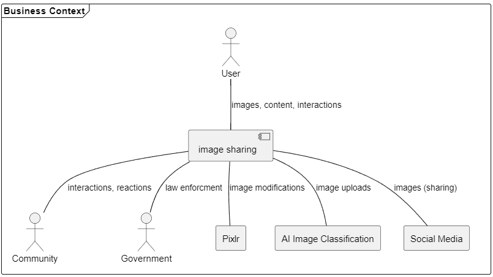

# 

**About arc42**

arc42, the template for documentation of software and system
architecture.

Template Version 8.2 EN. (based upon AsciiDoc version), January 2023

Created, maintained and © by Dr. Peter Hruschka, Dr. Gernot Starke and
contributors. See <https://arc42.org>.

This version of the template contains some help and explanations. It is
used for familiarization with arc42 and the understanding of the
concepts. For documentation of your own system you use better the
*plain* version.

# Introduction and Goals

The image sharing app allows users to upload, edit and share images with their friends, family and the wider community. 

## Requirements Overview

**Contents**

Main features of the app are:

* Upload photos
* Share photos with friends, family and the wider community
* Image editing with third party integration (Pixlr)
* Community feed, challenges and comment options for interacting with other users

## Quality Goals

| Priority | Quality     | Motivation                                                                                              |
| -------- | ----------- | ------------------------------------------------------------------------------------------------------- |
| 1        | Security    | Protect the private data and rights of our users to gather their trust.                                 |
| 2        | Reliability | Allows for rapid growth of our app. The platform must be able to handle hundreds of thousands of users. |
| 3        | Usability   | Make sure the user loves using our app.                                                                 |

## Stakeholders

| Role/Name               | Expectations                                                   |
| ----------------------- | -------------------------------------------------------------- |
| Investor 1              | Return of Investment (ROI) for his share on the company        |
| Investor 2              | Long term investment and growth                                |
| Team Leader             | Hassle-free executino of the project                           |
| Lead Marketing Engineer | Popularize and grow the app                                    |
| Lead System Architect   | Build and maintain a scalable and secure hardware architecture |
| Lead Software Architect | Implement the software itself                                  |

# Architecture Constraints

| Constraints                       | Backgrounds and/or motivation                                                                         |
| --------------------------------- | ----------------------------------------------------------------------------------------------------- |
| Ease of use                       | We want our app to be as accessible as possible                                                       |
| Advanced editing posibilities     | We want our users to stay within the app                                                              |
| Crossplatform Development         | We dont have the resources to maintain two codebases                                                  |
| Backend Implementation in Node.Js | While the Backend is implemented in JavaScript, the API will be designed based on the REST principles |
| OS Independent development        | The development should work regardless of the desktop OS, as our team uses multiple different devices |

# System Scope and Context

**Contents**

System scope and context - as the name suggests - delimits your system
(i.e. your scope) from all its communication partners (neighboring
systems and users, i.e. the context of your system). It thereby
specifies the external interfaces.

If necessary, differentiate the business context (domain specific inputs
and outputs) from the technical context (channels, protocols, hardware).

**Motivation**

The domain interfaces and technical interfaces to communication partners
are among your system’s most critical aspects. Make sure that you
completely understand them.

**Form**

Various options:

-   Context diagrams

-   Lists of communication partners and their interfaces.

See [Context and Scope](https://docs.arc42.org/section-3/) in the arc42
documentation.

## Business Context

Our system interacts with Pixlr to support advanced image editing use cases and also allows for sharing content on other social media platforms. To ensure compliance with legislation and also our own rules for allowed content, we use an external AI service to analize image uploads and classify them. Actors that interact with our system are the user and other users (community) as well as the government.

## Technical Context

**Contents**

The technical interfaces of our system comprise various channels and transmission media that connect our system with its environment. These interfaces facilitate the exchange of data and communication with external entities. They include:

**Motivation**

Understanding the technical interfaces between our system and its context is crucial for making architectural decisions. These interfaces significantly influence infrastructure and hardware design choices.

**Form**

The technical interfaces can be represented in various ways:

- **UML Deployment Diagram**: Describing channels to neighboring systems.
- **Mapping Table**: Showing relationships between channels and input/output.

**Explanation of Technical Interfaces**

- **HTTP/HTTPS Protocol**: This protocol serves as the primary means of interaction with external services, enabling functionalities like image editing through Pixlr integration and sharing content on other social media platforms. It processes incoming requests from users for various app features and sends corresponding responses.

- **Internal Messaging System**: This system allows different components or microservices within our app's architecture to communicate seamlessly. For instance, it facilitates interactions between the image processing service, user authentication service, and content sharing service.

- **Database Connectivity**: The database serves as a central repository for storing user-generated content, including uploaded images, user profiles, and application settings. It is accessed by various components to fetch required data and store new information.

**Mapping Input/Output to Channels**

| Input/Output               | Channel                       |
|----------------------------|-------------------------------|
| User image upload          | HTTP/HTTPS Protocol           |
| Image editing requests     | HTTP/HTTPS Protocol           |
| Content sharing            | HTTP/HTTPS Protocol           |
| Internal service requests  | Internal Messaging System    |
| Database queries/retrieval | Database Connectivity         |

This mapping table outlines the correspondence between specific input/output actions and the channels through which they operate within the system's technical interfaces.

# Solution Strategy

The app will be developed as a multiplatform app with a shared code base using the Flutter framework. While the flutter app represents the client side of the app, the backend and server will be implemented as a Node.JS application.

# Building Block View

## Whitebox Overall System

Here you describe the decomposition of the overall system using the
following white box template. It contains

-   an overview diagram

-   a motivation for the decomposition

-   black box descriptions of the contained building blocks. For these
    we offer you alternatives:

    -   use *one* table for a short and pragmatic overview of all
        contained building blocks and their interfaces

    -   use a list of black box descriptions of the building blocks
        according to the black box template (see below). Depending on
        your choice of tool this list could be sub-chapters (in text
        files), sub-pages (in a Wiki) or nested elements (in a modeling
        tool).

-   (optional:) important interfaces, that are not explained in the
    black box templates of a building block, but are very important for
    understanding the white box. Since there are so many ways to specify
    interfaces why do not provide a specific template for them. In the
    worst case you have to specify and describe syntax, semantics,
    protocols, error handling, restrictions, versions, qualities,
    necessary compatibilities and many things more. In the best case you
    will get away with examples or simple signatures.

***\<Overview Diagram>***

Motivation  
*\<text explanation>*

Contained Building Blocks  
*\<Description of contained building block (black boxes)>*

Important Interfaces  
*\<Description of important interfaces>*

Insert your explanations of black boxes from level 1:

If you use tabular form you will only describe your black boxes with
name and responsibility according to the following schema:

| **Name**         | **Responsibility** |
| ---------------- | ------------------ |
| *\<black box 1>* | *\<Text>*          |
| *\<black box 2>* | *\<Text>*          |

If you use a list of black box descriptions then you fill in a separate
black box template for every important building block . Its headline is
the name of the black box.

### \<Name black box 1>

Here you describe \<black box 1> according the the following black box
template:

-   Purpose/Responsibility

-   Interface(s), when they are not extracted as separate paragraphs.
    This interfaces may include qualities and performance
    characteristics.

-   (Optional) Quality-/Performance characteristics of the black box,
    e.g.availability, run time behavior, ….

-   (Optional) directory/file location

-   (Optional) Fulfilled requirements (if you need traceability to
    requirements).

-   (Optional) Open issues/problems/risks

*\<Purpose/Responsibility>*

*\<Interface(s)>*

*\<(Optional) Quality/Performance Characteristics>*

*\<(Optional) Directory/File Location>*

*\<(Optional) Fulfilled Requirements>*

*\<(optional) Open Issues/Problems/Risks>*

### \<Name black box 2>

*\<black box template>*

### \<Name black box n>

*\<black box template>*

### \<Name interface 1>

…

### \<Name interface m>

## Level 2

Here you can specify the inner structure of (some) building blocks from
level 1 as white boxes.

You have to decide which building blocks of your system are important
enough to justify such a detailed description. Please prefer relevance
over completeness. Specify important, surprising, risky, complex or
volatile building blocks. Leave out normal, simple, boring or
standardized parts of your system

### White Box *\<building block 1>*

…describes the internal structure of *building block 1*.

*\<white box template>*

### White Box *\<building block 2>*

*\<white box template>*

…

### White Box *\<building block m>*

*\<white box template>*

## Level 3

Here you can specify the inner structure of (some) building blocks from
level 2 as white boxes.

When you need more detailed levels of your architecture please copy this
part of arc42 for additional levels.

### White Box \<\_building block x.1\_\>

Specifies the internal structure of *building block x.1*.

*\<white box template>*

### White Box \<\_building block x.2\_\>

*\<white box template>*

### White Box \<\_building block y.1\_\>

*\<white box template>*

# Runtime View

**Contents**

The runtime view describes concrete behavior and interactions of the
system’s building blocks in form of scenarios from the following areas:

-   important use cases or features: how do building blocks execute
    them?

-   interactions at critical external interfaces: how do building blocks
    cooperate with users and neighboring systems?

-   operation and administration: launch, start-up, stop

-   error and exception scenarios

Remark: The main criterion for the choice of possible scenarios
(sequences, workflows) is their **architectural relevance**. It is
**not** important to describe a large number of scenarios. You should
rather document a representative selection.

**Motivation**

You should understand how (instances of) building blocks of your system
perform their job and communicate at runtime. You will mainly capture
scenarios in your documentation to communicate your architecture to
stakeholders that are less willing or able to read and understand the
static models (building block view, deployment view).

**Form**

There are many notations for describing scenarios, e.g.

-   numbered list of steps (in natural language)

-   activity diagrams or flow charts

-   sequence diagrams

-   BPMN or EPCs (event process chains)

-   state machines

-   …

See [Runtime View](https://docs.arc42.org/section-6/) in the arc42
documentation.

## \<Runtime Scenario 1>

-   *\<insert runtime diagram or textual description of the scenario>*

-   *\<insert description of the notable aspects of the interactions
    between the building block instances depicted in this diagram.>*

## \<Runtime Scenario 2>

## …

## \<Runtime Scenario n>

# Deployment View

**Content**

The deployment view describes:

1.  technical infrastructure used to execute your system, with
    infrastructure elements like geographical locations, environments,
    computers, processors, channels and net topologies as well as other
    infrastructure elements and

2.  mapping of (software) building blocks to that infrastructure
    elements.

Often systems are executed in different environments, e.g. development
environment, test environment, production environment. In such cases you
should document all relevant environments.

Especially document a deployment view if your software is executed as
distributed system with more than one computer, processor, server or
container or when you design and construct your own hardware processors
and chips.

From a software perspective it is sufficient to capture only those
elements of an infrastructure that are needed to show a deployment of
your building blocks. Hardware architects can go beyond that and
describe an infrastructure to any level of detail they need to capture.

**Motivation**

Software does not run without hardware. This underlying infrastructure
can and will influence a system and/or some cross-cutting concepts.
Therefore, there is a need to know the infrastructure.

Maybe a highest level deployment diagram is already contained in section
3.2. as technical context with your own infrastructure as ONE black box.
In this section one can zoom into this black box using additional
deployment diagrams:

-   UML offers deployment diagrams to express that view. Use it,
    probably with nested diagrams, when your infrastructure is more
    complex.

-   When your (hardware) stakeholders prefer other kinds of diagrams
    rather than a deployment diagram, let them use any kind that is able
    to show nodes and channels of the infrastructure.

See [Deployment View](https://docs.arc42.org/section-7/) in the arc42
documentation.

## Infrastructure Level 1

Describe (usually in a combination of diagrams, tables, and text):

-   distribution of a system to multiple locations, environments,
    computers, processors, .., as well as physical connections between
    them

-   important justifications or motivations for this deployment
    structure

-   quality and/or performance features of this infrastructure

-   mapping of software artifacts to elements of this infrastructure

For multiple environments or alternative deployments please copy and
adapt this section of arc42 for all relevant environments.

***\<Overview Diagram>***

Motivation  
*\<explanation in text form>*

Quality and/or Performance Features  
*\<explanation in text form>*

Mapping of Building Blocks to Infrastructure  
*\<description of the mapping>*

## Infrastructure Level 2

Here you can include the internal structure of (some) infrastructure
elements from level 1.

Please copy the structure from level 1 for each selected element.

### *\<Infrastructure Element 1>*

*\<diagram + explanation>*

### *\<Infrastructure Element 2>*

*\<diagram + explanation>*

…

### *\<Infrastructure Element n>*

*\<diagram + explanation>*

# Cross-cutting Concepts

## REST API

to enable consistent communication between the client and the server, we will use a REST API. This will allow us to use the same endpoints for all platforms and also makes it easier to implement the backend. 

## Image format (PNG)

To simplify the handling of images in general, all images will be converted to the PNG format. This will allow us to use the same image format for all images and also makes it easier to implement the image editing feature.

## Security and Privacy

All data that is not public will be stored and send e2e encrypted. This includes the user data, images and all other data that is not public. This will ensure that no one can access the data without the permission of the user.

## Common logging format
We will use a common logging format for all layers of our application and collect them in a single logging analyzation tool. This will allow us to easily analyze the logs and find errors.

# Architecture Decisions

## Multiplatform App
Date: 23.11.2023
### Context
We want to have our application available on all major platforms, including Android, iOS and Web.
### Decision
We will use Flutter to develop our application, as it allows us to develop a single codebase for all platforms.
### Status
Accepted
### Consequences
There will be a single codebase and also one UI/UX design for all patforms.
If we need to implement a feature that is not supported by Flutter, we will need to implement it natively for each platform.

## Scalable platform
Date: 23.11.2023
### Context
We want our application to be able to handle a large amount of users.
### Decision
We will use a horizontally scalable platform using Node.js.
### Status
Accepted
### Consequences
We still need to keep the scalability of the whole application in mind. The application must support multiple containers to be able to scale horizontally.

## Basic architectural approach
Date: 23.11.2023
### Context
We need to decide on a basic architectural approach for our application.
### Decision
We will use a client/server architecture.
### Status
Accepted
### Consequences
We need to make sure that the communication between the client and the server is secure and that the server is able to handle a large amount of requests (see scalable platform).

# Quality Requirements

**Content**

This section contains all quality requirements as quality tree with
scenarios. The most important ones have already been described in
section 1.2. (quality goals)

Here you can also capture quality requirements with lesser priority,
which will not create high risks when they are not fully achieved.

**Motivation**

Since quality requirements will have a lot of influence on architectural
decisions you should know for every stakeholder what is really important
to them, concrete and measurable.

See [Quality Requirements](https://docs.arc42.org/section-10/) in the
arc42 documentation.

## Quality Tree

**Content**

The quality tree (as defined in ATAM – Architecture Tradeoff Analysis
Method) with quality/evaluation scenarios as leafs.

**Motivation**

The tree structure with priorities provides an overview for a sometimes
large number of quality requirements.

**Form**

The quality tree is a high-level overview of the quality goals and
requirements:

-   tree-like refinement of the term "quality". Use "quality" or
    "usefulness" as a root

-   a mind map with quality categories as main branches

In any case the tree should include links to the scenarios of the
following section.

## Quality Scenarios

**Contents**

Concretization of (sometimes vague or implicit) quality requirements
using (quality) scenarios.

These scenarios describe what should happen when a stimulus arrives at
the system.

For architects, two kinds of scenarios are important:

-   Usage scenarios (also called application scenarios or use case
    scenarios) describe the system’s runtime reaction to a certain
    stimulus. This also includes scenarios that describe the system’s
    efficiency or performance. Example: The system reacts to a user’s
    request within one second.

-   Change scenarios describe a modification of the system or of its
    immediate environment. Example: Additional functionality is
    implemented or requirements for a quality attribute change.

**Motivation**

Scenarios make quality requirements concrete and allow to more easily
measure or decide whether they are fulfilled.

Especially when you want to assess your architecture using methods like
ATAM you need to describe your quality goals (from section 1.2) more
precisely down to a level of scenarios that can be discussed and
evaluated.

**Form**

Tabular or free form text.

# Risks and Technical Debts

* Image editing might be a complex topic
  * None of us is experienced with editing of images, so we might need to do some trainings on this topic or even consult a professional to get this right. Another option would be to implement this feature later on.
* Content filtering
  * We need to think about how we can make sure that no nsfw or even illegal content is posted and can be removed immediately. One option would be to use AI Image detection to filter images with a high risk.
* Disk space
  * As everyone can upload images on our platform, we might need to figure out limits for the space people can use.

# Glossary

**Contents**

The most important domain and technical terms that your stakeholders use
when discussing the system.

You can also see the glossary as source for translations if you work in
multi-language teams.

**Motivation**

You should clearly define your terms, so that all stakeholders

-   have an identical understanding of these terms

-   do not use synonyms and homonyms

A table with columns \<Term> and \<Definition>.

Potentially more columns in case you need translations.

See [Glossary](https://docs.arc42.org/section-12/) in the arc42
documentation.

| Term        | Definition        |
| ----------- | ----------------- |
| *\<Term-1>* | *\<definition-1>* |
| *\<Term-2>* | *\<definition-2>* |
